 

> *Como la añañuca que duerme bajo la aridez*  
> *y florece después de la lluvia, sin aviso,*  
> *así construyo — en silencio, con paciencia —*  
> *código que despierta cuando se necesita.*

 

 

## I. La Raíz · *Quién Soy*

Soy estudiante de Ingeniería en Tecnologías de la Información radicado en **Coquimbo, Chile** — tierra de cielos despejados, durazneros en flor y el desierto florido. Me muevo entre la terminal, el soldador y la pizarra con la misma comodidad.

- **Ayudante universitario** en cuatro cátedras: *Programación (Python)*, *Seguridad Informática y Hacking Ético*, *Ingeniería de Software* e *IoT*. Enseñar para consolidar el dominio técnico.
- **IoT & Acuicultura:** Sistemas de telemetría y monitoreo en tiempo real para laboratorios de cultivo Biofloc, integrando sensores físicos y dashboards operativos.
- **Arquitectura & Hardware:** Diseño y ensamblaje de teclados mecánicos personalizados y análisis de arquitecturas de software y firmware embebido.

 

 

## II. La Hoja Afilada · *EclipSec*

> *El toki que vuela en el cielo nocturno no es ornamento. Es intención.*

**EclipSec** es la consultoría de ciberseguridad que cofundé. Operamos en hacking ético, pentesting, análisis de vulnerabilidades y auditorías de infraestructura para organizaciones que se toman en serio su defensa digital.

 

 

## III. El Árbol · *Arsenal*

**Hardware & IoT**

**Desarrollo & Datos**

 

 

## IV. Los Frutos · *Proyectos*

| Área | Proyecto | Descripción | Stack |
| :--- | :--- | :--- | :--- |
| Ciberseguridad | **EclipSec** | Consultoría en hacking ético, pentesting y auditorías de infraestructura. | `Pentest` · `OWASP` · `Kali` |
| IoT / Acuicultura | **UCN Biofloc IoT** | Monitoreo de calidad de agua en tiempo real para laboratorio de acuicultura (UCN). | `ESP32` · `MongoDB` · `Streamlit` |
| Robótica / Embebidos | **Biofloc-Firmware-ROS** | Firmware C++ para ESP32 con micro-ROS — nodo central ROS 2 Jazzy. | `C++` · `ESP-IDF` · `micro-ROS` |
| Backend / Cloud | **Guayacan-Project** | Ecosistema e-commerce contenerizado. Arquitectura híbrida PostgreSQL + MongoDB. | `Node.js` · `TypeScript` · `Docker` |
| Domótica / Redes | **Smart-Lighting IoT** | Sistema de iluminación inteligente controlado por red local. | `HTML` · `IoT` · `MCU` |

 

 

## V. El Florecimiento · *Estadísticas*

  

 

 

 

## VI. Semillas · *Contacto*

Si te interesa conversar sobre ciberseguridad, arquitecturas de red, hardware embebido o teclados mecánicos — eres bienvenido.

 

 

*Del Norte Chico al bit. De la aridez a la flor.*

